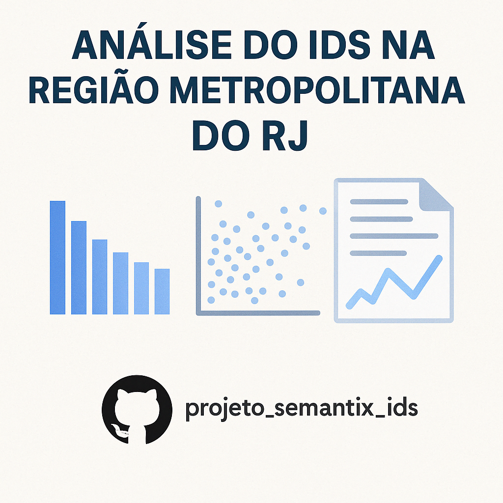

<p align="center">
  
</p>


# Projeto Semantix – Análise do Índice de Desenvolvimento Social (IDS)

## 1. Introdução

Este projeto tem como objetivo aplicar análise de dados para investigar o Índice de Desenvolvimento Social (IDS) na Região Metropolitana do Rio de Janeiro, a fim de identificar áreas vulneráveis e propor ações sociais baseadas em evidências.

## 2. Fontes de Dados

Os dados utilizados são públicos e obtidos do Censo 2010. A base contém:

- Índice de Desenvolvimento Social (IDS)
- Renda dos responsáveis por domicílio
- Taxa de analfabetismo entre crianças de 10 a 14 anos
- Indicadores de acesso à água, esgoto e coleta de lixo

## 3. Análise Exploratória de Dados (EDA)

A EDA foi realizada com auxílio de Python e Looker Studio, incluindo:

- Comparação de bairros com maiores e menores IDS
- Correlações entre IDS e variáveis de renda e educação
- Tabela interativa com todos os bairros e seus indicadores sociais

## 4. Principais Insights

- Bairros com maior proporção de renda elevada (>10 SM) tendem a ter IDS mais alto.
- Áreas com analfabetismo acima da média apresentam IDS consideravelmente mais baixos.
- Bairros com IDS abaixo de 0,4 foram mapeados como prioritários para ação pública.

## 5. Recomendações com Base em Dados

- Implementar programas de alfabetização e reforço escolar
- Oferecer capacitação profissional e incentivo à formalização
- Expandir infraestrutura básica (água, esgoto, coleta de lixo)
- Monitorar anualmente indicadores sociais críticos

## 6. Visualização Interativa

Dashboard disponível em:
[👉 Acessar no Looker Studio](https://lookerstudio.google.com/reporting/3ea00673-7037-41da-89d4-3f95d00026a4)

## 7. Estrutura do Repositório

```
📁 projeto_semantix_ids/
├── dados/
│   └── IDS_RMRJ_Tratada_Completa.xlsx
├── notebooks/
│   └── eda_ids_rmrj.ipynb
├── relatorios/
│   └── Relatorio_Final_IDS_Semantix.pdf
├── README.md
```

## 8. Conclusão

Este projeto mostra o poder da análise de dados para mapear desigualdades e embasar ações públicas mais eficazes. O uso de indicadores sociais permite decisões mais precisas, com foco nas áreas que mais precisam.

---

Desenvolvido para fins acadêmicos e sociais, no contexto do Desafio Semantix.
